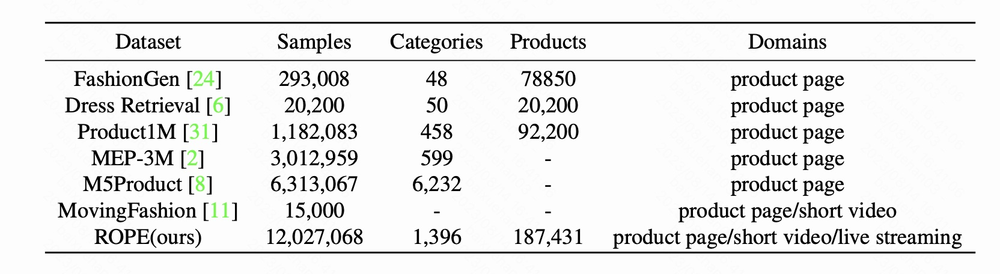

__cRoss-dOmain Product rEcognition dataset (COPE)___ covers a wide range of product categories and contains over 180,000 products, corresponding to millions of short videos and live streams. It is the first dataset to cover product pages, short videos, and live streams simultaneously, providing the basis for establishing a unified product representation across different media domains.

<table><tr>
<td>  </td>
<td>  </td>
<td>  </td>
</tr></table>

__Statistics__

<p align="center">
  
</p>
  
The ROPE dataset comprises 3,056,624 product pages, 5,867,526 short videos, and 3,495,097 live streams associated with 189,958 products. We divided the ROPE dataset into train and test sets. 

The train set has 187,431 products with 3,025,236 product pages, 5,837,716 short videos, and 3,464,116 live streams. While the test set contains 2,527 products, with 31,388 product pages, 29,810 short videos, and 30,981 live streams.


## Download 
We organize the url data of the dataset into nine *txt* files for training set. 
- training_product_pages_pair.txt : the product pages and correspond products.
- training_product_videos_pair.txt : the short videos and correspond products.
- training_product_lives_pair.txt : the live clips and correspond products.
- training_page_titles.txt : the title text of product pages.
- training_video_asrs.txt: the ASR info of short videos.
- training_live_asrs.txt: the ASR info of live clips.
- training_page_images.txt : the main image url of product pages.
- training_video_frames.txt: the frame url of short video frames.
- training_live_clips.txt : the frmae url of live clip frames. 


### file format

#### training_product_pages_pair.txt
```bash
99721, 7
```

training_product_pages_pair.txt have a pair of product id and product page id every row, splited by commas * , * . For example, * 99721 * indicts the id of a product while * 7 * indicts the id of a product page.

#### training_product_videos_pair.txt
```bash
26140, 3179594
```

training_product_videos_pair.txt have a pair of product id and short video id every row, splited by commas * , * . For example, * 26140 * indicts the id of a product while * 3179594 * indicts the id of a short video. 

#### training_product_lives_pair.txt
```bash
99721, 2240805
```

training_product_lives_pair.txt have a pair of product id and live clip id every row, splited by commas * , * . For example, * 99721 * indicts the id of a product while * 2240805 * indicts the id of a live clip. 

#### training_page_titles.txt
```bash
1366457, 简约西装外套
```

training_page_titles.txt have a pair of product page id and it's title every row, splited by commas * , * .

#### training_video_asrs.txt

```bash
2830227, 不买亏大了,碧根果才1元,限时限量速抢 \cdots 
```

training_video_asrs.txt have a pair of short video id and it's ASR texts every row, splited by commas * , * .

#### training_live_asrs.txt

```bash
24,  内里是加绒加棉加厚咱这个衣服 \cdots 
```

training_live_asrs.txt have a pair of live clip id and it's ASR texts every row, splited by commas * , * .

#### training_page_images.txt

```bash
728, eae32f52-2a9a-11ee-a32e-507c6f3c3e56.jpg 
```

training_page_images.txt have a pair of product page id and it's image name every row, splited by commas * , * . 

#### training_video_frames.txt

```bash
1105250, 240, 6c67b8b0-2c83-11ee-8e82-b8cef63cdeda.jpg 
```

training_video_frames.txt have a pair of short video id, frame number and it's image name every row, splited by commas * , * . The smaller the frame number is, the earlier the frame happens. The whole frames could be obtained by sorting the frames with same short video id by frame number.

#### training_live_clips.txt

```bash
1718832, 1668122889829, 08318640-2c84-11ee-87b6-043f72c2ce50.jpg 
```

training_live_clips.txt have a pair of live clip id, timestamp and it's image name every row, splited by commas * , * . The smaller the timestamp is, the earlier the frame happens. The whole frames could be obtained by sorting the frames with same live clip id by timestamp.


### url example
```bash
https://js-ad.a.yximgs.com/bs2/ad-material-video/dfc3f0ca-2a9a-11ee-afd0-507c6f3c3e56.jpg
```
An example of image url, where *https://js-ad.a.yximgs.com/bs2/ad-material-video/* is the prefix, 

*dfc3f0ca-2a9a-11ee-afd0-507c6f3c3e56* is the name of image. Any image url could be download by concat the prefix with its image name. 


## Download the url files
To download the COPE data, please fill in the licensing agreement << Licensing Agreement of ROPE Dataset.docx >> and email it to **jiajian@kuaishou.com**  or  **chenquan06@kuaishou.com** . We will email you the download link of the files.


## Code
We have released the code here. 

 
## Citation

```bibtex
@article{bai2023crossdomain,
  title={Cross-Domain Product Representation Learning for Rich-Content E-Commerce},
  author={Xuehan Bai and Yan Li and Yanhua Cheng and Wenjie Yang and Quan Chen and Han Li},
  journal={arXiv preprint arXiv:2308.05550},
  year={2023}
}
```
